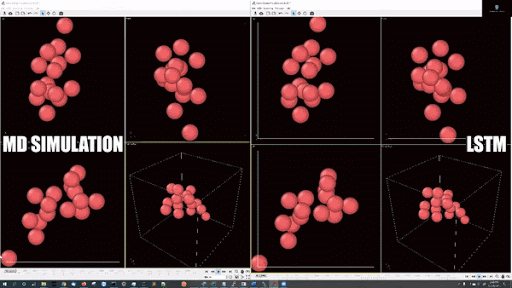
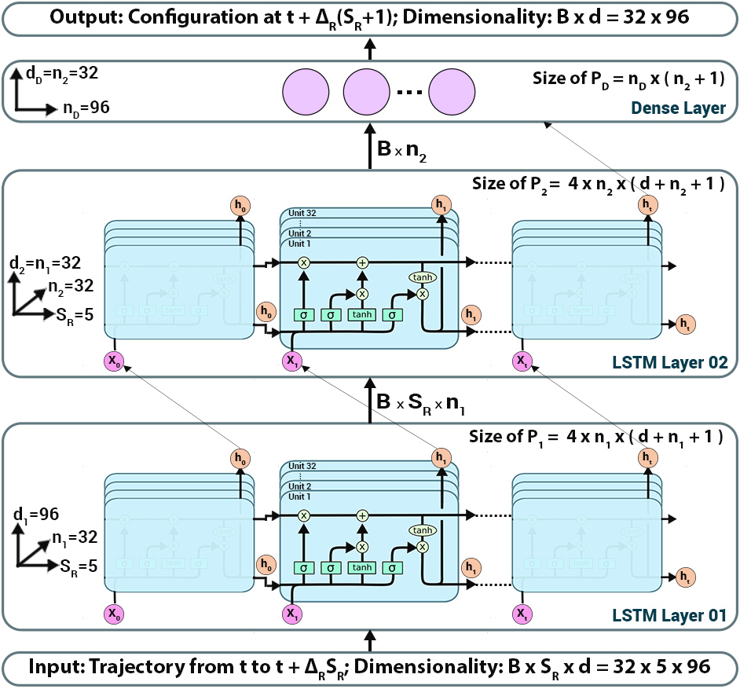

# Simulating Molecular Dynamics with Large Timesteps using Recurrent Neural Networks
JCS Kadupitiya, Geoffrey C. Fox, Vikram Jadhao | 2020

* Molecular dynamics simulations rely on numerical integrators such as Verlet to solve the Newton's equations of motion. Using a sufficiently small timestep to avoid discretization errors, Verlet integrators generate a trajectory of particle positions as solutions to the equations of motions. We introduce an integrator based on recurrent neural networks that is trained on trajectories generated using Verlet integrator and learns to propagate the dynamics of particles with timestep up to 4000 times larger compared to the Verlet timestep. We demonstrate significant net speedup of up to 32000 for few-particle (1 - 16) 3D systems and over a variety of force fields.

* Paper: [https://arxiv.org/abs/2004.06493](https://arxiv.org/abs/2004.06493)

* Example simulations with LJ potentail
 * 16 particle in a periodic boundary simulation: 
 * 16 particle in a spherical hard wall simulation: 

* Cite as:
```
@misc{kadupitiya2020simulating,
    title={Simulating Molecular Dynamics with Large Timesteps using Recurrent Neural Networks},
    author={JCS Kadupitiya and Geoffrey C. Fox and Vikram Jadhao},
    year={2020},
    eprint={2004.06493},
    archivePrefix={arXiv},
    primaryClass={physics.comp-ph}
}
```

* Overview of the deep learning approach


* RNN-MD architecture

